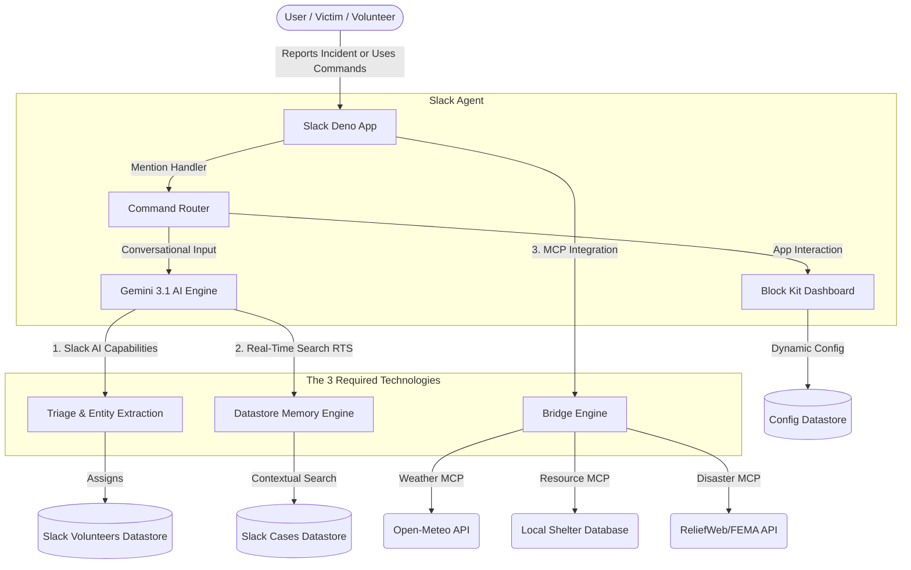

# Lifeline: AI Crisis Coordination Agent 🛡️

**Winner/Submission for Slack Agent Builder Challenge 2026**

Lifeline is an advanced, AI-powered Slack Agent designed to coordinate disaster response, triage incoming crisis reports, and intelligently allocate humanitarian resources in real-time. It leverages the cutting-edge Slack Developer stack, integrating all three required technologies to create a seamless, context-aware command center directly inside Slack.

## 🏗️ Architecture



## ✨ Key Features

1. **AI-Powered Case Intake**: Mention `@Lifeline` with a natural language report (e.g., "A tree fell on my house"). The AI automatically extracts the location, severity, and special needs, and creates a formal incident case.
2. **Contextual Memory (RTS Fallback)**: Automatically queries past incidents for similar patterns, providing volunteers with historical context (e.g., "This neighborhood flooded 2 years ago, they used sandbags from X").
3. **MCP-Powered Command Center**: Brings real-time external data into Slack.
   - Live extreme weather alerts dynamically configured to the organization's location.
   - Resource locators (`@Lifeline resources shelter miami`) querying geographic bounding boxes.
4. **Automated Volunteer Matching**: Matches the specific needs of a crisis (e.g., "medical") with the registered skills of online volunteers, pinging them directly to claim the case.
5. **Interactive Block Kit Dashboard**: A central hub to view active cases, run macro-pattern checks against external disaster APIs, and manage organizational settings.

## 🚀 Setup & Installation

1. **Clone the repository:**
   ```bash
   git clone https://github.com/Nabarup1/Lifeline-AI-Crisis-Response.git
   cd Lifeline-AI-Crisis-Response
   ```
2. **Install dependencies and configure Slack CLI:**
   ```bash
   npm install
   slack login
   ```
3. **Configure the environment variables:**
   Copy the example environment file and insert your API keys:
   ```bash
   cp .env.example .env
   ```
   *(Make sure to open `.env` and add your Google Gemini API Key)*

4. **Start the local MCP server and Slack App:**
   ```bash
   slack run
   ```
5. **Create the Triggers:**
   In another terminal, install the essential triggers to your workspace:
   ```bash
   slack trigger create --trigger-def triggers/app_mention_trigger.ts
   slack trigger create --trigger-def triggers/pattern_trigger.ts
   slack trigger create --trigger-def triggers/lifeline_shortcut.ts
   ```

## 🛠️ Usage (End-to-End Test)

1. **Configure the App:**
   - Run the shortcut `/Lifeline Command` or click the shortcut link provided by the CLI.
   - In the Dashboard, click **Settings**. Set your operating location to `Miami, FL` (or wherever you want to test weather alerts).
   
2. **Register as a Volunteer:**
   - In the Dashboard, click **Register Volunteer**. Input your skills (e.g., `medical, rescue`).

3. **Report a Crisis:**
   - Go to a channel where the bot is invited and say:
     `@Lifeline There are 5 people trapped by flood waters on 5th avenue, we need immediate medical help.`
   - Watch the AI triage the event, create a case, and instantly DM you (the matched volunteer) with an assignment!

4. **Find Resources via MCP:**
   - In the case thread, ask the bot for local resources:
     `@Lifeline resources shelter miami`
   - The MCP server will geocode the request and return exact shelter capacities.

5. **Resolve the Case:**
   - Click **Claim Case**, then **Resolve Case** in the original thread. Your volunteer stats will dynamically update!

## 🧩 Technologies Used

- **Deno / Slack next-gen platform**: Serverless Edge execution.
- **Model Context Protocol (MCP)**: Connecting the Slack app to local Python/Node resource servers.
- **Google Gemini 3.1 Flash**: Fast, high-accuracy reasoning for triage and entity extraction.
- **Slack Datastores**: Persisting cases, configurations, and volunteer stats without an external database.
